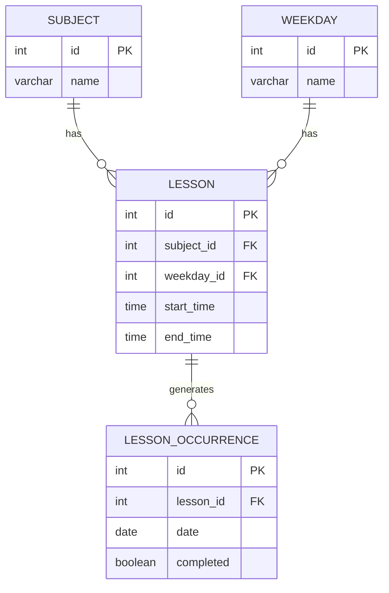

# API Dados - Documentação

API para gerenciamento de cronograma de aulas.

## Início Rápido

```bash
# Instalar dependências
bun install

# Rodar migrations
bun run migrate

# Iniciar servidor
bun run dev
```

O servidor inicia em `http://localhost:3010`

---

## Variáveis de Ambiente

| Variável | Default | Descrição |
|----------|---------|-----------|
| `PORT` | 3010 | Porta do servidor |
| `HOST` | 0.0.0.0 | Host do servidor |
| `DATABASE_PATH` | ./data/database.db | Caminho do SQLite |
| `CORS_ORIGIN` | * | Origem permitida |

---

## Banco de Dados



### Tabelas

| Tabela | Descrição |
|--------|-----------|
| `SUBJECT` | Matérias |
| `WEEKDAY` | Dias da semana |
| `LESSON` | Aulas (horários fixos) |
| `LESSON_OCCURRENCE` | Ocorrências de aulas (datas específicas) |

---

## Paginação

Endpoints de listagem retornam resposta paginada:

```json
{
  "data": [],
  "total": 0,
  "page": 1,
  "limit": 10
}
```

**Query params:**
| Param | Tipo | Default | Descrição |
|-------|------|---------|-----------|
| `page` | number | 1 | Página atual |
| `limit` | number | 10 | Itens por página (max: 100) |

---

## Endpoints

### Status

#### `GET /status`

Verifica se o servidor está funcionando.

**Response:**
```json
{
  "statusServer": "ok"
}
```

---

### Matérias (Subjects)

#### `GET /materias`

Lista todas as matérias.

**Query Params:**
| Param | Tipo | Descrição |
|-------|------|-----------|
| `search` | string | Buscar por nome |

**Response:**
```json
{
  "data": [
    { "id": 1, "name": "Matemática" }
  ],
  "total": 1,
  "page": 1,
  "limit": 10
}
```

---

#### `GET /materias/:id`

Busca uma matéria pelo ID.

**Response:**
```json
{
  "id": 1,
  "name": "Matemática"
}
```

**Errors:**
- `404` - Matéria não encontrada

---

#### `POST /materias`

Cria uma nova matéria.

**Body:**
```json
{
  "name": "Matemática"
}
```

| Campo | Tipo | Obrigatório | Descrição |
|-------|------|-------------|-----------|
| `name` | string | Sim | Nome da matéria |

**Response:**
```json
{
  "id": 1,
  "name": "Matemática"
}
```

**Errors:**
- `400` - Campo obrigatório: name

---

#### `PUT /materias/:id`

Atualiza uma matéria existente.

**Body:**
```json
{
  "name": "Matemática Atualizada"
}
```

**Response:**
```json
{
  "id": 1,
  "name": "Matemática Atualizada"
}
```

**Errors:**
- `400` - Campo obrigatório: name
- `404` - Matéria não encontrada

---

#### `DELETE /materias/:id`

Deleta uma matéria.

**Response:**
```json
{
  "message": "Matéria deletada com sucesso"
}
```

**Errors:**
- `400` - Não é possível deletar matéria com aulas vinculadas
- `404` - Matéria não encontrada

---

### Dias da Semana (Weekdays)

#### `GET /dias`

Lista todos os dias da semana.

**Response:**
```json
[
  { "id": 1, "name": "Monday" },
  { "id": 2, "name": "Tuesday" }
]
```

---

#### `POST /dias`

Cria um novo dia.

**Body:**
```json
{
  "name": "Feriado"
}
```

**Response:**
```json
{
  "id": 8,
  "name": "Feriado"
}
```

**Errors:**
- `400` - Campo obrigatório: name

---

#### `DELETE /dias/:id`

Deleta um dia.

**Response:**
```json
{
  "message": "Dia deletado com sucesso"
}
```

**Errors:**
- `400` - Não é possível deletar dia com aulas vinculadas
- `404` - Dia não encontrado

---

### Cronograma (Aulas)

#### `GET /cronograma`

Lista todas as aulas com nomes de matéria e dia da semana.

**Query Params:**
| Param | Tipo | Descrição |
|-------|------|-----------|
| `weekday_id` | number | Filtrar por dia da semana |
| `subject_id` | number | Filtrar por matéria |

**Response:**
```json
{
  "data": [
    {
      "id": 1,
      "subject_id": 1,
      "weekday_id": 1,
      "start_time": "08:00",
      "end_time": "09:00",
      "subject_name": "Matemática",
      "weekday_name": "Monday"
    }
  ],
  "total": 1,
  "page": 1,
  "limit": 10
}
```

---

#### `GET /cronograma/:id`

Busca uma aula pelo ID.

**Response:**
```json
{
  "id": 1,
  "subject_id": 1,
  "weekday_id": 1,
  "start_time": "08:00",
  "end_time": "09:00",
  "subject_name": "Matemática",
  "weekday_name": "Monday"
}
```

**Errors:**
- `404` - Aula não encontrada

---

#### `POST /cronograma`

Cria uma nova aula.

**Body:**
```json
{
  "subject_id": 1,
  "weekday_id": 1,
  "start_time": "08:00",
  "end_time": "09:00"
}
```

| Campo | Tipo | Obrigatório | Descrição |
|-------|------|-------------|-----------|
| `subject_id` | number | Sim | ID da matéria |
| `weekday_id` | number | Sim | ID do dia da semana |
| `start_time` | string | Sim | Horário de início (HH:MM) |
| `end_time` | string | Sim | Horário de fim (HH:MM) |

**Response:**
```json
{
  "id": 1,
  "subject_id": 1,
  "weekday_id": 1,
  "start_time": "08:00",
  "end_time": "09:00"
}
```

**Errors:**
- `400` - Campos obrigatórios faltando
- `400` - Subject não encontrado
- `400` - Weekday não encontrado
- `400` - Formato de hora inválido

---

#### `PUT /cronograma/:id`

Atualiza uma aula existente.

**Body:**
```json
{
  "subject_id": 2,
  "weekday_id": 3,
  "start_time": "10:00",
  "end_time": "11:00"
}
```

**Response:**
```json
{
  "id": 1,
  "subject_id": 2,
  "weekday_id": 3,
  "start_time": "10:00",
  "end_time": "11:00"
}
```

**Errors:**
- `400` - Campos obrigatórios faltando
- `400` - Subject não encontrado
- `400` - Weekday não encontrado
- `404` - Aula não encontrada

---

#### `DELETE /cronograma/:id`

Deleta uma aula e todas as suas ocorrências.

**Response:**
```json
{
  "message": "Aula deletada com sucesso"
}
```

**Errors:**
- `404` - Aula não encontrada

---

#### `POST /cronograma/:id/gerar-ocorrencias`

Gera ocorrências automáticas para um período.

**Body:**
```json
{
  "start_date": "2025-01-06",
  "end_date": "2025-06-30"
}
```

| Campo | Tipo | Obrigatório | Descrição |
|-------|------|-------------|-----------|
| `start_date` | string | Sim | Data inicial (YYYY-MM-DD) |
| `end_date` | string | Sim | Data final (YYYY-MM-DD) |

**Response:**
```json
{
  "message": "26 ocorrência(s) criada(s)",
  "created": 26
}
```

**Errors:**
- `400` - Campos obrigatórios faltando
- `400` - Formato de data inválido
- `404` - Aula não encontrada

---

### Ocorrências de Aula

#### `GET /cronograma/:lessonId/ocorrencias`

Lista todas as ocorrências de uma aula.

**Query Params:**
| Param | Tipo | Descrição |
|-------|------|-----------|
| `completed` | boolean | Filtrar por status |
| `from` | string | Data inicial (YYYY-MM-DD) |
| `to` | string | Data final (YYYY-MM-DD) |

**Response:**
```json
{
  "data": [
    {
      "id": 1,
      "lesson_id": 1,
      "date": "2025-01-15",
      "completed": 0
    }
  ],
  "total": 1,
  "page": 1,
  "limit": 10
}
```

**Errors:**
- `404` - Aula não encontrada

---

#### `GET /cronograma/:lessonId/ocorrencias/:id`

Busca uma ocorrência específica.

**Response:**
```json
{
  "id": 1,
  "lesson_id": 1,
  "date": "2025-01-15",
  "completed": 1
}
```

**Errors:**
- `404` - Ocorrência não encontrada

---

#### `POST /cronograma/:lessonId/ocorrencias`

Cria uma nova ocorrência para uma aula.

**Body:**
```json
{
  "date": "2025-01-15",
  "completed": true
}
```

| Campo | Tipo | Obrigatório | Descrição |
|-------|------|-------------|-----------|
| `date` | string | Sim | Data da ocorrência (YYYY-MM-DD) |
| `completed` | boolean | Não | Se a aula foi realizada (default: false) |

**Response:**
```json
{
  "id": 1,
  "lesson_id": 1,
  "date": "2025-01-15",
  "completed": true
}
```

**Errors:**
- `400` - Campo obrigatório: date
- `400` - Formato de data inválido
- `404` - Aula não encontrada

---

#### `PUT /cronograma/:lessonId/ocorrencias/:id`

Atualiza uma ocorrência existente.

**Body:**
```json
{
  "date": "2025-01-20",
  "completed": true
}
```

| Campo | Tipo | Obrigatório | Descrição |
|-------|------|-------------|-----------|
| `date` | string | Não | Nova data |
| `completed` | boolean | Não | Novo status |

*Envie pelo menos um campo.*

**Response:**
```json
{
  "id": 1,
  "lesson_id": 1,
  "date": "2025-01-20",
  "completed": true
}
```

**Errors:**
- `400` - Envie ao menos um campo: date, completed
- `400` - Formato de data inválido
- `404` - Ocorrência não encontrada

---

#### `DELETE /cronograma/:lessonId/ocorrencias/:id`

Deleta uma ocorrência.

**Response:**
```json
{
  "message": "Ocorrência deletada com sucesso"
}
```

**Errors:**
- `404` - Ocorrência não encontrada

---

### Dashboard

#### `GET /dashboard`

Retorna resumo geral do sistema.

**Response:**
```json
{
  "subjects": 5,
  "lessons": 12,
  "occurrences": 50,
  "completed": 30,
  "completionRate": 60
}
```

---

#### `GET /dashboard/semanal`

Retorna aulas da semana atual.

**Response:**
```json
{
  "startDate": "2025-01-06",
  "endDate": "2025-01-12",
  "data": [
    {
      "id": 1,
      "date": "2025-01-06",
      "completed": 0,
      "start_time": "08:00",
      "end_time": "09:00",
      "subject_name": "Matemática",
      "weekday_name": "Monday"
    }
  ]
}
```

---

#### `GET /dashboard/estatisticas`

Retorna estatísticas por matéria.

**Response:**
```json
{
  "bySubject": [
    {
      "name": "Matemática",
      "total_lessons": 3,
      "total_occurrences": 15,
      "completed": 10
    }
  ]
}
```

---

## Scripts

| Comando | Descrição |
|---------|-----------|
| `bun run dev` | Inicia servidor com hot reload |
| `bun run build` | Build para produção |
| `bun run start` | Inicia build de produção |
| `bun run migrate` | Roda migrations pendentes |
| `bun run migrate:reset` | Reseta banco e roda migrations |
| `bun run test` | Roda todos os testes |
| `bun run test:watch` | Roda testes em watch mode |

---

## Tech Stack

- **Runtime:** Bun
- **Framework:** Express
- **Banco:** SQLite (bun:sqlite)
- **Testes:** bun:test
- **Linguagem:** TypeScript
- **Middleware:** CORS, Logger, Error Handler, Validation
